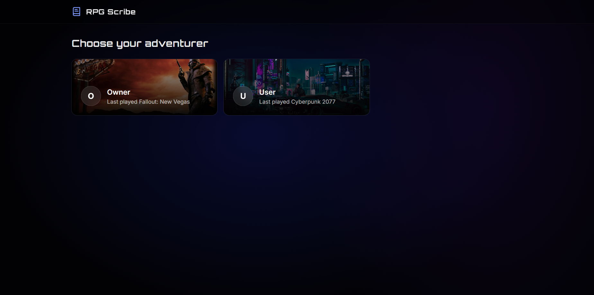
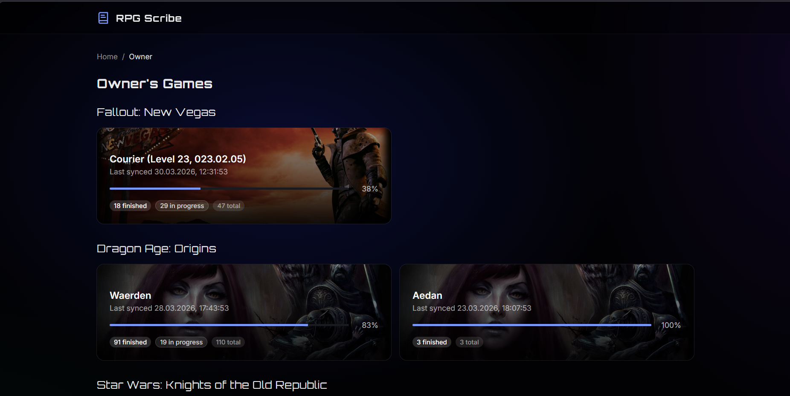
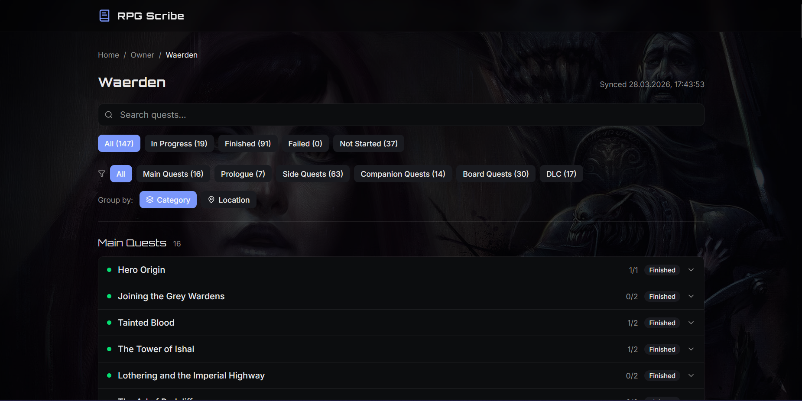
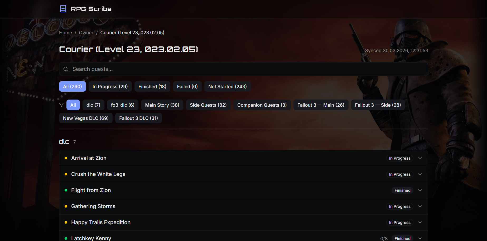

# RPG Scribe

A self-hosted quest tracker for single-player RPGs. Automatically parses your save files, extracts quest progress, and presents it in a web dashboard — so you always know where you left off.

> **Currently supports:** Fallout: New Vegas (including TTW), Dragon Age: Origins, Cyberpunk 2077, and Star Wars: KOTOR

### Game Support Status

| Game | Status | Notes |
|------|--------|-------|
| Dragon Age: Origins | Stable | Fully tested back to back across complete playthroughs |
| Fallout: New Vegas | Stable | Tested across multiple saves with different ESM load orders and game stages, TTW supported |
| Cyberpunk 2077 | WIP | Parser functional, back-to-back testing still needed to ensure accurate quest tracking |
| Star Wars: KOTOR | WIP | Parser functional, back-to-back testing still needed to ensure accurate quest tracking |

## Screenshots

<p align="center">
  
  
</p>
<p align="center">
  
  
</p>

## How It Works

```
Save file changes  →  Desktop app detects change  →  Python parser extracts quest data  →  Server stores & serves  →  Web UI
```

1. The **desktop app** (Tauri) watches your save directories for changes
2. When a save changes, it runs a **Python parser** that reads the binary save format and extracts quest states
3. Parsed data is POSTed to the **Go server**, which stores it in PostgreSQL
4. The **web dashboard** shows your progress across all games, playthroughs, and characters in real time via WebSocket

## Security Warning

> **This application has no user authentication by design.** It is built for personal use on a local network or behind a VPN such as [WireGuard](https://www.wireguard.com/), [Tailscale](https://tailscale.com/), or [NetBird](https://netbird.io/).
>
> **Do NOT expose this to the public internet** unless you fully understand the risks and add your own authentication layer (e.g., reverse proxy with auth). Anyone with network access to the server can view and modify all data. The API key provides basic request validation, not security.

## Quick Start (Docker)

The fastest way to get running. Requires [Docker](https://docs.docker.com/get-docker/) and [Docker Compose](https://docs.docker.com/compose/).

**1. Clone and configure**

```bash
git clone --recursive https://github.com/Vem0n/RPG-scribe.git
cd RPG-scribe
cp .env.example .env
```

Edit `.env` and set your credentials:

```env
DB_PASS=pick-a-strong-password
API_KEY=pick-a-secret-api-key
PORT=8081
```

**2. Start the server**

```bash
docker compose up -d
```

The server will automatically run database migrations and seed quest data on first boot. Check the logs to verify:

```bash
docker compose logs server
```

You should see:

```
[OK] DATABASE_URL configured
[OK] API_KEY configured
[SEED] Found seed data in /data/seed-data
seeded Cyberpunk 2077: 227 quests
seeded Fallout: New Vegas: 287 quests
...
[START] Launching RPG Scribe server...
```

**3. Open the dashboard**

Navigate to `http://localhost:8081` in your browser.

## Development Setup

### Prerequisites

- Go 1.23+
- Node.js 22+
- Python 3.12+ (for save parsers)
- PostgreSQL 16 (or use Docker: `docker run -d --name rpg-scribe-postgres -e POSTGRES_USER=rpgscribe -e POSTGRES_PASSWORD=rpgscribe -e POSTGRES_DB=rpgscribe -p 5432:5432 postgres:16-alpine`)
- Rust 1.77+ (only for the desktop app)

### External dependencies

The save parsers for some games depend on third-party libraries. Clone them into the project root:

```bash
# Required for Cyberpunk 2077 save parsing
git clone https://github.com/fmwviormv/CyberpunkPythonHacks.git

# Required for Dragon Age: Origins save parsing
git clone https://github.com/xelrach/DASaveReader.git
```

Fallout: New Vegas and KOTOR parsers have no external dependencies.

### Running locally

```bash
# Copy environment config
cp .env.example .env

# Start the server (reads .env automatically in dev)
make dev-server

# In another terminal — start the web UI
make dev-web

# Seed the database with quest definitions
make seed
```

The web UI will be at `http://localhost:5173` and the API at `http://localhost:8081`.

### Desktop app

The Tauri desktop app handles file watching and automatic sync — it's what actually detects save changes and triggers the parsers. Without it, you'd need to call the Python parsers and API manually.

To run it:

```bash
cd desktop
npm install
npx tauri dev
```

### Build from source

```bash
# Build server with embedded web UI
make build

# Or build the Docker image directly
make docker
```

## Environment Variables

| Variable | Required | Default | Description |
|----------|----------|---------|-------------|
| `DATABASE_URL` | Yes (local dev) | — | PostgreSQL connection string (auto-constructed in Docker) |
| `API_KEY` | Yes | — | Shared key for API request validation |
| `DB_USER` | No | `rpgscribe` | PostgreSQL username (Docker only) |
| `DB_PASS` | Yes (Docker) | — | PostgreSQL password (Docker only) |
| `DB_NAME` | No | `rpgscribe` | PostgreSQL database name (Docker only) |
| `PORT` | No | `8081` | Host port mapped to the server (Docker only) |
| `SEED_DATA_DIR` | No | `./seed-data` | Path to quest definition JSON files |
| `ENV` | No | `production` | Set to `development` for debug logging |
| `SEED_ON_START` | No | `true` | Set to `false` to skip auto-seeding in Docker |

## Backup & Restore

RPG Scribe stores all data in PostgreSQL. To migrate your data to a new machine:

**Backup:**

```bash
./deploy/backup.sh
# Saves to backups/rpgscribe_<timestamp>.sql
```

**Restore on the new machine:**

```bash
# Start the stack first
docker compose up -d

# Then restore your backup
./deploy/restore.sh backups/rpgscribe_20260410_113933.sql

# Restart to pick up changes
docker compose restart server
```

## Project Structure

```
RPG-scribe/
├── server/          Go API server (Gin + PostgreSQL)
├── web/             React dashboard (Vite + Tailwind)
├── desktop/         Tauri desktop app (file watcher + sync)
├── scraper/         Python save file parsers (per game)
├── tools/           Shared parsing utilities
├── seed-data/       Quest definitions (JSON)
├── deploy/          Dockerfile, entrypoint, backup/restore scripts
└── docker-compose.yml
```

## Tech Stack

- **Server:** Go, Gin, PostgreSQL, WebSocket
- **Web UI:** React 19, Vite, Tailwind CSS, TypeScript
- **Desktop:** Tauri 2, Rust, React
- **Parsers:** Python (binary format readers for each game engine)

## License

[MIT](LICENSE)
